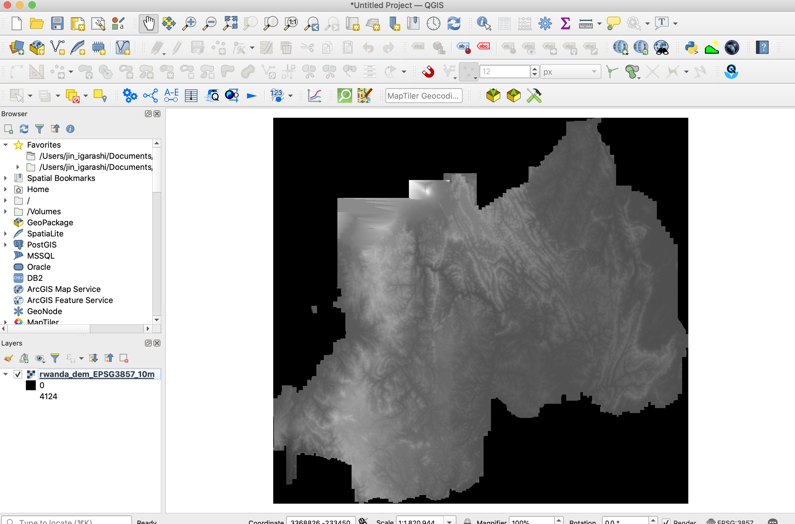
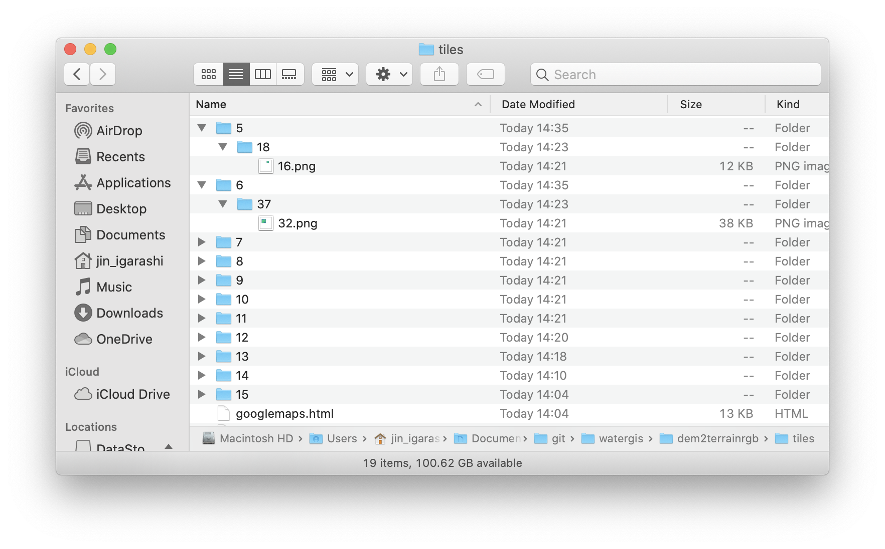
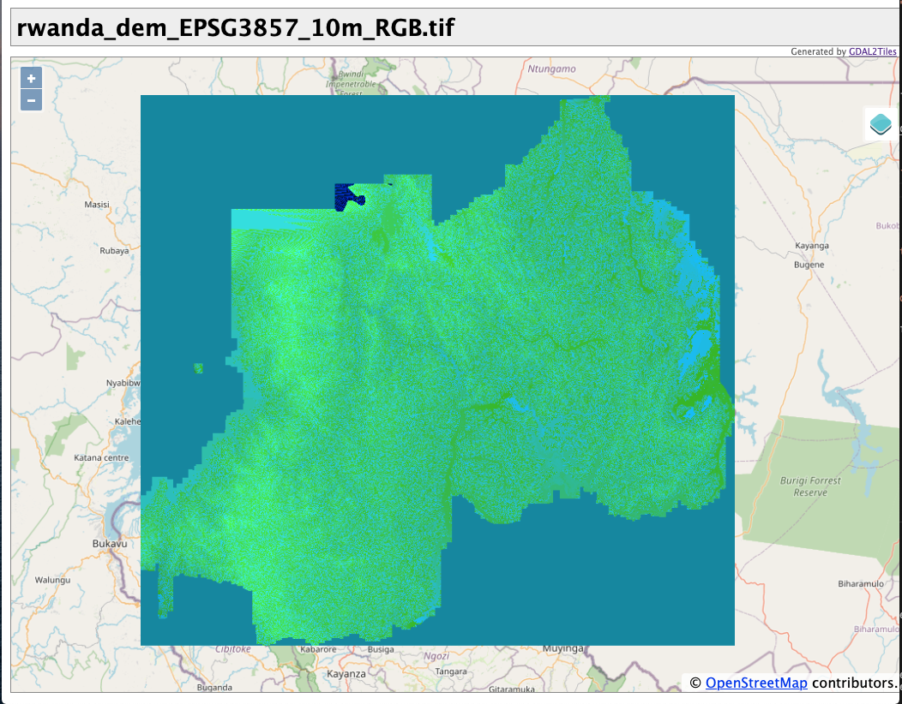
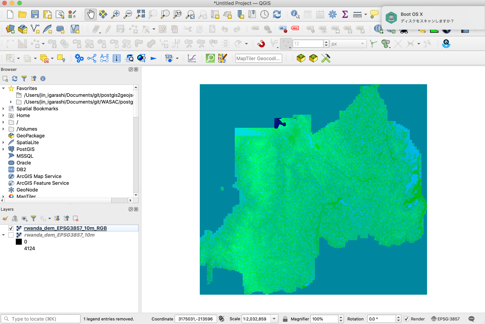

In this section, we are going to develop terrain RGB raster tileset from your own DEM.

Here, we will use 10m DEM which is owned by WASAC in Rwanda as an example. The below is a sample image of Rwanda DEM on QGIS.



## 1. Trasform projection of DEM to EPSG:3857

First, you must transform the projection of your DEM to Web Mercator (EPSG:3857) by using QGIS or GDAL tool.

## 2. Setup `dem2terrainrgb` tool in your computer

For converting your DEM to terrain RGB raster tile, you must use several commands as follows. 

- Resetting the value for No Data
- RGB-ify DEM data
- Create raster tilsets

But I already develop a simple pythion script to create terrain RGB tile from DEM. Before installing this tool, please make sure you have installed `Python3.9` and `GDAL3.2.0` in your machine.

For installation, you just do the below commands.
```
git clone https://github.com/watergis/dem2terrainrgb.git
cd dem2terrainrgb
pipenv install
```

Put your DEM under `data` folder.

```
mkdir data
mv ~/rwanda_dem_EPSG3857_10m.tif data/.
```

## 3. Create Terrain RGB raster tilesets

Now, we run the tool to convert DEM to tilesets.
```
pipenv shell
python main.py --dem ./data/rwanda_dem_EPSG3857_10m.tif --dist ./tiles
```

Terrain RGB raster tilesets are normally generated between zoom level 5 and 15. So this process might take a bit time to complete.

```bash
filled NODATA value successfully: ./tmp/rwanda_dem_EPSG3857_10m_without_nodata.tif
rgbified successfully: ./tmp/rwanda_dem_EPSG3857_10m_RGB.tif
created tileset successfully: ./tiles
```

After processing, raster tilesets will be generated under `tiles` folder.

However, we need to delete all of unnecessary "*.xml" files as the below command before going to next step.

```bash
find ./tiles -name "*.xml" -exec bash -c 'rm "$1"' - '{}' \;
```

## 4. Check terrain RGB raster tilesets

All of tiles will be created under `tiles` folder.



GDAL2tiles generated some example source code for leaflet and openlayers. You may double-click `openlayers.html` to check it on your browser.




## 5. Validate processed file

This tool will generated 2 tiff image under `tmp` folder. First, we can validate these files.

- validate `rwanda_dem_EPSG3857_10m_without_nodata.tif`

This geotiff image was filled value instead of No Data.

```
$ rio info --indent 2 ./tmp/rwanda_dem_EPSG3857_10m_without_nodata.tif
```

```json
{
  "blockxsize": 256,
  "blockysize": 256,
  "bounds": [
    3223733.0877,
    -316437.17616185057,
    3439718.7685284764,
    -115768.6321
  ],
  "colorinterp": [
    "gray"
  ],
  "compress": "deflate",
  "count": 1,
  "crs": "EPSG:3857",
  "descriptions": [
    null
  ],
  "driver": "GTiff",
  "dtype": "uint16",
  "height": 19992,
  "indexes": [
    1
  ],
  "interleave": "band",
  "lnglat": [
    29.92940323722318,
    -1.9409140983431143
  ],
  "mask_flags": [
    [
      "all_valid"
    ]
  ],
  "nodata": null,
  "res": [
    10.037442179964515,
    10.037442179964515
  ],
  "shape": [
    19992,
    21518
  ],
  "tiled": true,
  "transform": [
    10.037442179964515,
    0.0,
    3223733.0877,
    0.0,
    -10.037442179964515,
    -115768.6321,
    0.0,
    0.0,
    1.0
  ],
  "units": [
    null
  ],
  "width": 21518
}
```

- validate `rwanda_dem_EPSG3857_10m_RGB.tif`

This geotiff image was already rgb-ified by raster io module. You can check by the below command.

```
$ rio info --indent 2 ./tmp/rwanda_dem_EPSG3857_10m_RGB.tif
```

We can see now there is 3 bands color.
```json
{
  "blockxsize": 256,
  "blockysize": 256,
  "bounds": [
    3223733.0877,
    -316437.17616185057,
    3439718.7685284764,
    -115768.6321
  ],
  "colorinterp": [
    "red",
    "green",
    "blue"
  ],
  "compress": "deflate",
  "count": 3,
  "crs": "EPSG:3857",
  "descriptions": [
    null,
    null,
    null
  ],
  "driver": "GTiff",
  "dtype": "uint8",
  "height": 19992,
  "indexes": [
    1,
    2,
    3
  ],
  "interleave": "band",
  "lnglat": [
    29.92940323722318,
    -1.9409140983431143
  ],
  "mask_flags": [
    [
      "all_valid"
    ],
    [
      "all_valid"
    ],
    [
      "all_valid"
    ]
  ],
  "nodata": null,
  "res": [
    10.037442179964515,
    10.037442179964515
  ],
  "shape": [
    19992,
    21518
  ],
  "tiled": true,
  "transform": [
    10.037442179964515,
    0.0,
    3223733.0877,
    0.0,
    -10.037442179964515,
    -115768.6321,
    0.0,
    0.0,
    1.0
  ],
  "units": [
    null,
    null,
    null
  ],
  "width": 21518
}
```

If you add rgbified geotiff on QGIS, the image should be as below.



We can try to calcurate elevation by certain coordinates from bands values.

The formula used to calculate the elevation is
```
height = -10000 + ((R * 256 * 256 + G * 256 + B) * 0.1)
```

We can use `gdallocationinfo` to query band values by coordinates.

```bash
$ gdallocationinfo -wgs84 ./tmp/rwanda_dem_EPSG3857_10m_RGB.tif 29.7363 -2.2313
Report:
  Location: (8617P,13218L)
  Band 1:
    Value: 1
  Band 2:
    Value: 199
  Band 3:
    Value: 250
(rwanda_terrain)
```

