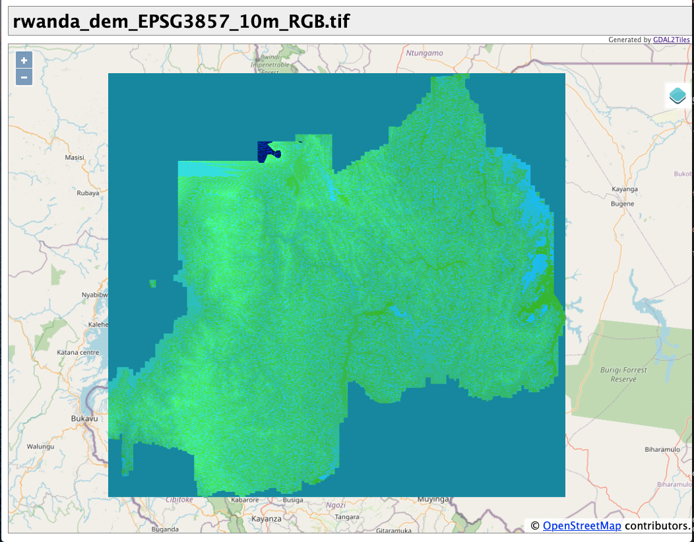
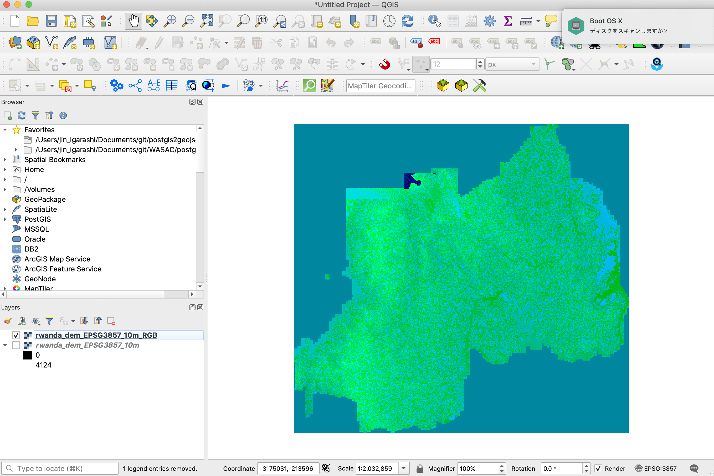

このセクションでは、自組織が持っているDEMからTerrain RGBのラスタタイルセットを開発していきます。

ここでは、ルワンダのWASACが所有する10m精度のDEMを例として使っていきます。下のはQGISでルワンダのDEMを表示した際のイメージです。


## 1. DEMの座標系をEPSG:3857に変換する。

まず、DEMの座標系をウェブメルカトル（EPSG:3857）にQGISやGDALなどのツールで変換する必要があります。

## 2. ローカルマシンに`dem2terrainrgb`ツールをセットアップ

DEMをTerrain RGBに変換するには次のようなことをするいくつかのコマンドを実行する必要があります。

- No Dataに値を設定する。
- DEMデータをRGB化する
- ラスタタイルセットを作る

しかし既にDEMからTerrain RGBタイルを作るシンプルなPythonスクリプトを作っていますのでご心配なく。このツールをインストールする前に、`Python3.9`と`GDAL3.2.0`がマシンにインストールされているかをチェックしてください。

インストールは以下のようなコマンドを実行するだけです。
```
git clone https://github.com/watergis/dem2terrainrgb.git
cd dem2terrainrgb
pipenv install
```

`data`フォルダにDEMファイルをおきましょう。

```
mkdir data
mv ~/rwanda_dem_EPSG3857_10m.tif data/.
```

## 3. Terrain RGBラスタタイルセットを生成する

いよいよ、DEMをタイルセットに変換するツールを実行します。
```
pipenv shell
python main.py --dem ./data/rwanda_dem_EPSG3857_10m.tif --dist ./tiles
```

Terrain RGBラスタタイルセットは通常ズームレベル5から15の間で生成されます。この処理は少し時間がかかる可能性があります。 

```bash
filled NODATA value successfully: ./tmp/rwanda_dem_EPSG3857_10m_without_nodata.tif
rgbified successfully: ./tmp/rwanda_dem_EPSG3857_10m_RGB.tif
created tileset successfully: ./tiles
```

処理が終わると、ラスタタイルセットが`tiles`フォルダにできているはずです。

しかしながら、次のステップに行く前にまず不要な`*.xml`ファイルを全て次のコマンドで削除しておきます。 

```bash
find ./tiles -name "*.xml" -exec bash -c 'rm "$1"' - '{}' \;
```

## 4. terrain RGBラスタタイルセットの確認

全てのタイルは`tiles`フォルダにできているはずです。


GDAL2tilesはLeafletとOpenlayersのサンプルソースコードも生成します。 `openlayers.html`をダブルクリックしてブラウザでタイルを確認してみます。




## 5. 処理したファイルをチェックする

このツールを使うと2つのTiffファイルが`tmp`フォルダに保存されます。まずこれらのファイルがちゃんとできているかチェックしてみます。

- `rwanda_dem_EPSG3857_10m_without_nodata.tif`の確認

このGeoTiff画像はNo Dataの値を埋めたものです。

```
$ rio info --indent 2 ./tmp/rwanda_dem_EPSG3857_10m_without_nodata.tif
```

```json
{
  "blockxsize": 256,
  "blockysize": 256,
  "bounds": [
    3223733.0877,
    -316437.17616185057,
    3439718.7685284764,
    -115768.6321
  ],
  "colorinterp": [
    "gray"
  ],
  "compress": "deflate",
  "count": 1,
  "crs": "EPSG:3857",
  "descriptions": [
    null
  ],
  "driver": "GTiff",
  "dtype": "uint16",
  "height": 19992,
  "indexes": [
    1
  ],
  "interleave": "band",
  "lnglat": [
    29.92940323722318,
    -1.9409140983431143
  ],
  "mask_flags": [
    [
      "all_valid"
    ]
  ],
  "nodata": null,
  "res": [
    10.037442179964515,
    10.037442179964515
  ],
  "shape": [
    19992,
    21518
  ],
  "tiled": true,
  "transform": [
    10.037442179964515,
    0.0,
    3223733.0877,
    0.0,
    -10.037442179964515,
    -115768.6321,
    0.0,
    0.0,
    1.0
  ],
  "units": [
    null
  ],
  "width": 21518
}
```

- `rwanda_dem_EPSG3857_10m_RGB.tif`の確認

このGeoTiff画像はRaster IOモジュールによってRGB化されたものです。下のコマンドでチェックできます。

```
$ rio info --indent 2 ./tmp/rwanda_dem_EPSG3857_10m_RGB.tif
```

3バンドの色ができていることが確認できます。
```json
{
  "blockxsize": 256,
  "blockysize": 256,
  "bounds": [
    3223733.0877,
    -316437.17616185057,
    3439718.7685284764,
    -115768.6321
  ],
  "colorinterp": [
    "red",
    "green",
    "blue"
  ],
  "compress": "deflate",
  "count": 3,
  "crs": "EPSG:3857",
  "descriptions": [
    null,
    null,
    null
  ],
  "driver": "GTiff",
  "dtype": "uint8",
  "height": 19992,
  "indexes": [
    1,
    2,
    3
  ],
  "interleave": "band",
  "lnglat": [
    29.92940323722318,
    -1.9409140983431143
  ],
  "mask_flags": [
    [
      "all_valid"
    ],
    [
      "all_valid"
    ],
    [
      "all_valid"
    ]
  ],
  "nodata": null,
  "res": [
    10.037442179964515,
    10.037442179964515
  ],
  "shape": [
    19992,
    21518
  ],
  "tiled": true,
  "transform": [
    10.037442179964515,
    0.0,
    3223733.0877,
    0.0,
    -10.037442179964515,
    -115768.6321,
    0.0,
    0.0,
    1.0
  ],
  "units": [
    null,
    null,
    null
  ],
  "width": 21518
}
```

QGISでRGB化したGeoTiffを追加すると下のように表示されるでしょう。



ある特定の座標でバンド値から標高を計算してみることもできます。

標高を計算する式は次のようになります。
```
height = -10000 + ((R * 256 * 256 + G * 256 + B) * 0.1)
```

`gdallocationinfo`を使って座標のバンド値を調べられます。

```bash
$ gdallocationinfo -wgs84 ./tmp/rwanda_dem_EPSG3857_10m_RGB.tif 29.7363 -2.2313
Report:
  Location: (8617P,13218L)
  Band 1:
    Value: 1
  Band 2:
    Value: 199
  Band 3:
    Value: 250
(rwanda_terrain)
```

