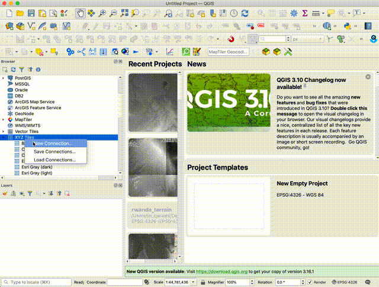

In this section, we are going to host terrain RGB raster tileset which we generated in previous section.

For hosting tiles, you will have two choices.

1. Host tiles on Github pages
1. Host tiles on your own server

## 1. Host tiles on Github pages

In Rwanda's case, our size of tilesets are below 1GB, so we hosted it on our Github pages.

- Create Github repository

We named `rw-terrain` as our hosted repository on Github.

- Clone it to your local machine

```bash
git clone git@github.com:WASAC/rw-terrain.git
cd rw-terrain
```

- Move tiles folder under `docs` directory.

```bash
mkdir docs
cd docs
mv ../../dem2terrainrgb/data/tiles tiles
```

You may delete unnecessary `*.html` files from `tiles` folder.

- Create metadata.json under `tiles` folder

```bash
vi metadata.json
```
```json
{
  "name": "Rwanda 10m Terrain RGB Tileset",
  "description": "Rwanda 10m Terrain RGB Tileset, CC-BY-4.0: Water and Sanitation Corporation (WASAC), Rwanda",
  "version": "1"
}
```

- Create `LICENSE` file under root directory

We are using `Creative Commons Attribution 4.0 International License`. You may copy our license file to your repository.

```
cd ..
wget https://raw.githubusercontent.com/WASAC/rw-terrain/main/LICENSE
```

- Create `README.md`

Finally, do not forget to write `README.md` for users. You may modify our [README.md(https://github.com/WASAC/rw-terrain/blob/main/README.md) for your data.

- Configure Github pages

Now, you can push this repository to Github, then please configure Github pages setting.

You can access tilesets from the below URL.
```
https://wasac.github.io/rw-terrain/tiles/{z}/{x}/{y}.png
```

---
## 2. Host tiles on your own server

### Create `mbtiles` from raster tilesets

If you want to host tilesets on your own server, first you need to create `mbtiles` container by using [mb-utils](https://github.com/mapbox/mbutil) tool.

Go back to `dem2terrainrgb` repository folder.

```
cd ~/dem2terrainrgb
```

Then, create `metadata.json` under `tiles` directory.

```bash
vi tiles/metadata.json
```
```json
{
  "name": "Rwanda 10m Terrain RGB Tileset",
  "description": "Rwanda 10m Terrain RGB Tileset, CC-BY-4.0: Water and Sanitation Corporation (WASAC), Rwanda",
  "version": "1"
}
```

Finally, you can execute `mb-utils` to create mbtiles under tilesets folder.

```bash
mb-util --image_format=png --scheme=xyz ./tiles/ ./tilesets/rwanda_dem_EPSG3857_10m.mbtiles
```

### Hosting on mbtileserver

You may be able to use [mbtilesserver](https://github.com/consbio/mbtileserver).

After installing `mbtileserver`,

```
~/go/bin/mbtileserver --verbose
```

it will automatically find mbtiles under `tilesets` folder, then access to [http://localhost:8000/services](http://localhost:8000/services). You will see the following response.

```json
[
    {
        "imageType": "png",
        "url": "http://localhost:8000/services/rwanda_dem_EPSG3857_10m",
        "name": "Rwanda 10m Terrain RGB Tileset"
    }
]
```

After that, continue to access [http://localhost:8000/services/rwanda_dem_EPSG3857_10m](http://localhost:8000/services/rwanda_dem_EPSG3857_10m) and see more detailed information.

```json
{
    "description": "Rwanda 10m Terrain RGB Tileset, CC-BY-4.0: Water and Sanitation Corporation (WASAC), Rwanda",
    "format": "png",
    "map": "http://localhost:8000/services/rwanda_dem_EPSG3857_10m/map",
    "maxzoom": 15,
    "minzoom": 5,
    "name": "Rwanda 10m Terrain RGB Tileset",
    "scheme": "xyz",
    "tilejson": "2.1.0",
    "tiles": [
        "http://localhost:8000/services/rwanda_dem_EPSG3857_10m/tiles/{z}/{x}/{y}.png"
    ],
    "version": "1"
}
```

Tileset URL will be as below.
```
http://localhost:8000/services/rwanda_dem_EPSG3857_10m/tiles/{z}/{x}/{y}.png
```

You can use QGIS's xyz tile layer funciton to validate your tile hosting.

