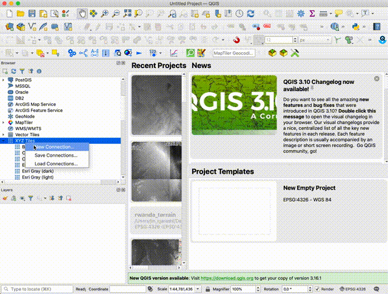

このセクションでは、前回生成したTerrain RGBラスタタイルセットをホストしていきます。

タイルをホストするには次の2つの選択肢があります。

1. Github pagesでタイルをホストする
1. サーバーにタイルをホストする

## 1. Github pagesでタイルをホストする

ルワンダのケースでは、タイルセットのサイズは1GB以下なので、Github pagesにホストしました。

- Githubにリポジトリを作る

`rw-terrain`という名前でGithubにタイルをホストするリポジトリを作りました。

- ローカルマシンにリポジトリをクローンする

```bash
git clone git@github.com:WASAC/rw-terrain.git
cd rw-terrain
```

- タイルのフォルダを`docs`フォルダに移動する

```bash
mkdir docs
cd docs
mv ../../dem2terrainrgb/data/tiles tiles
```

不要なら、`tiles`フォルダから`*.html`ファイルを削除することができます。

- `tiles`フォルダにmetadata.jsonを作る

```bash
vi metadata.json
```
```json
{
  "name": "Rwanda 10m Terrain RGB Tileset",
  "description": "Rwanda 10m Terrain RGB Tileset, CC-BY-4.0: Water and Sanitation Corporation (WASAC), Rwanda",
  "version": "1"
}
```

- リポジトリのルートに`LICENSE`ファイルを作る

`Creative Commons Attribution 4.0 International License`というライセンスをルワンダでは使っています。ルワンダのライセンスファイルを再利用することもできます。

```
cd ..
wget https://raw.githubusercontent.com/WASAC/rw-terrain/main/LICENSE
```

- `README.md`を作る

最後に, 利用者のために`README.md`を書くのを忘れないようにしてください。 ルワンダの[README.md(https://github.com/WASAC/rw-terrain/blob/main/README.md) を編集して作ることもできます。

- Github pagesの設定をする

ここで、このリポジトリをGithubにプッシュをし、Github pagesの設定を行ってください。

下のようなURLでタイルセットにアクセスできるようになります。
```
https://wasac.github.io/rw-terrain/tiles/{z}/{x}/{y}.png
```

---
## 2. サーバーにタイルをホストする

### ラスタタイルセットから`mbtiles`を作る

もしタイルセットを自身のサーバーにホストしたい場合、まず[mb-utils](https://github.com/mapbox/mbutil)ツールを使って`mbtiles`コンテナを作る必要があります。

`dem2terrainrgb`リポジトリのフォルダに戻ります。

```
cd ~/dem2terrainrgb
```

`tiles`フォルダに`metadata.json`を作ります。

```bash
vi tiles/metadata.json
```
```json
{
  "name": "Rwanda 10m Terrain RGB Tileset",
  "description": "Rwanda 10m Terrain RGB Tileset, CC-BY-4.0: Water and Sanitation Corporation (WASAC), Rwanda",
  "version": "1"
}
```

最後に、`mb-utils`を実行してtilesetsフォルダにmbtilesを作ります。

```bash
mb-util --image_format=png --scheme=xyz ./tiles/ ./tilesets/rwanda_dem_EPSG3857_10m.mbtiles
```

### mbtileserverでホストする

[mbtilesserver](https://github.com/consbio/mbtileserver)というソフトウェアを使うことができます。

`mbtileserver`をインストールした後、以下を実行します。

```
~/go/bin/mbtileserver --verbose
```

自動的に`tilesets`フォルダの中のmbtilesを探し出し、その後[http://localhost:8000/services](http://localhost:8000/services)にアクセスできるようになります。次のようなレスポンスを見ることができるでしょう。

```json
[
    {
        "imageType": "png",
        "url": "http://localhost:8000/services/rwanda_dem_EPSG3857_10m",
        "name": "Rwanda 10m Terrain RGB Tileset"
    }
]
```

次に、続けて[http://localhost:8000/services/rwanda_dem_EPSG3857_10m](http://localhost:8000/services/rwanda_dem_EPSG3857_10m)にアクセスし、詳細な情報を見てみます。

```json
{
    "description": "Rwanda 10m Terrain RGB Tileset, CC-BY-4.0: Water and Sanitation Corporation (WASAC), Rwanda",
    "format": "png",
    "map": "http://localhost:8000/services/rwanda_dem_EPSG3857_10m/map",
    "maxzoom": 15,
    "minzoom": 5,
    "name": "Rwanda 10m Terrain RGB Tileset",
    "scheme": "xyz",
    "tilejson": "2.1.0",
    "tiles": [
        "http://localhost:8000/services/rwanda_dem_EPSG3857_10m/tiles/{z}/{x}/{y}.png"
    ],
    "version": "1"
}
```

タイルセットのURLは下のようになります。
```
http://localhost:8000/services/rwanda_dem_EPSG3857_10m/tiles/{z}/{x}/{y}.png
```

QGISのxyzタイルレイヤー機能を使ってホストしたタイルをチェックすることができます。

