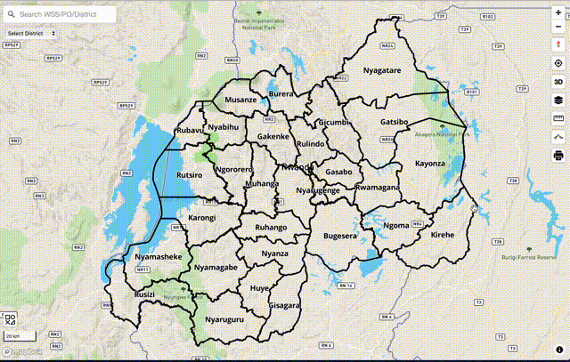

In this section, we are going to use terrain RGB raster tileset on Mapbox GL JS

## 1. Add Hillshade layer to your style



If you have your own terrain RGB tilesets, it is easier to add hillshade layer to your `style.json`.

First, add your raster tilesets information to `sources` like below.
```json
"sources": {
  "rwanda-dem":{
    "type": "raster-dem",
    "tiles": [
        "https://wasac.github.io/rw-terrain/tiles/{z}/{x}/{y}.png"
    ],
    "tileSize": 512,
    "maxzoom": 15
  }
}
```

Then, you can add hillshade layer like this.

```json
"layers": [
  {
    "id": "hillshade",
    "type": "hillshade",
    "source": "rwanda-dem",
    "minzoom": 5,
    "maxzoom": 14,
    "layout": {},
    "paint": {
      "hillshade-accent-color": "#5a5a5a",
      "hillshade-exaggeration": 0.5,
      "hillshade-highlight-color": "#FFFFFF",
      "hillshade-illumination-anchor": "viewport",
      "hillshade-illumination-direction": 335,
      "hillshade-shadow-color": "#5a5a5a"
    }
  }
]
```

You can visit [Rwanda's web site](https://rural.water-gis.com) to see hillshade style as an example. Change style to `UN Vector` to compare how it is different from Mapbox's hillshade layer.

## 2. Add Elevation plugin to your app


In water utilities, elevation is so significant. Thus, I developed a Mapbox GL JS plugin [mapbox-gl-elevation](https://github.com/watergis/mapbox-gl-elevation). It can query altitude information from terrain RGB raster tilesets.

You can install it to your Mapbox GL JS app as follows.

```
npm i @watergis/mapbox-gl-elevation --save
```

Then, add elevation control to Map object. Please specify your tilesets' URL.
```js
import MapboxElevationControl from "@watergis/mapbox-gl-elevation";
import '@watergis/mapbox-gl-elevation/css/styles.css';
import mapboxgl from 'mapbox-gl';

const map = new mapboxgl.Map();
map.addControl(new MapboxElevationControl(
        'https://wasac.github.io/rw-terrain/tiles/{z}/{x}/{y}.png',
        { 
          font: ['Roboto Medium'],
          fontSize: 12,
          fontHalo: 1,
          mainColor: '#263238',
          haloColor: '#fff',
        }
    ), 'top-right');
});
```



See demo from [here](https://watergis.github.io/mapbox-gl-elevation/#12/-1.08551/35.87063).

## 3. Add 3D view to your app (for Mapbox GL JS v2)


If your Mapbox GL JS app already upgraded to v2, you can use terrain RGB to make 3D easily by adding some configurations to your `style.json`.

First, add your raster tilesets information like below.
```json
"sources": {
  "rwanda-dem":{
    "type": "raster-dem",
    "tiles": [
        "https://wasac.github.io/rw-terrain/tiles/{z}/{x}/{y}.png"
    ],
    "tileSize": 512,
    "maxzoom": 15
  }
},
"terrain": {
  "source": "rwanda-dem",
  "exaggeration": 1.5
},
```

You can also see detailed information from their official page [here](https://docs.mapbox.com/mapbox-gl-js/style-spec/terrain/).

If you want to add `sky` layer, just add it to `layers` section of `style.json`.

```json
"layers" : [
  {
      "id": "sky",
      "type": "sky",
      "paint": {
      "sky-type": "atmosphere",
      "sky-atmosphere-sun": [0.0, 0.0],
      "sky-atmosphere-sun-intensity": 15
      }
  }
]
```



See demo from [here](https://wasac.github.io/mapboxgljs-v2/#14.05/-1.94034/30.04433/-17.6/71). Change style to `terrain` for 3D view.

Note. recently Mapbox GL JS changed their license from BSD to proprietary license. If your app's usage exceeds their free tier program, Mapbox will charge you some fees according to your usage.