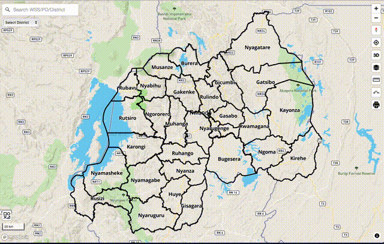
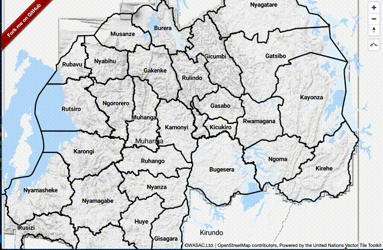

このセクションでは、Mapbox GL JSでTerrain RGBのラスタタイルセットを使用していきます。

## 1. 陰影起伏図レイヤをスタイルに追加する



Terrain RGBタイルセットがあれば、簡単に陰影起伏図レイヤを`style.json`に追加できます。

まず、ラスタタイルセットの情報を次のように`sources`に追記します。
```json
"sources": {
  "rwanda-dem":{
    "type": "raster-dem",
    "tiles": [
        "https://wasac.github.io/rw-terrain/tiles/{z}/{x}/{y}.png"
    ],
    "tileSize": 512,
    "maxzoom": 15
  }
}
```

それから、次のように陰影起伏図レイヤを追加できます。

```json
"layers": [
  {
    "id": "hillshade",
    "type": "hillshade",
    "source": "rwanda-dem",
    "minzoom": 5,
    "maxzoom": 14,
    "layout": {},
    "paint": {
      "hillshade-accent-color": "#5a5a5a",
      "hillshade-exaggeration": 0.5,
      "hillshade-highlight-color": "#FFFFFF",
      "hillshade-illumination-anchor": "viewport",
      "hillshade-illumination-direction": 335,
      "hillshade-shadow-color": "#5a5a5a"
    }
  }
]
```

[ルワンダのサイト](https://rural.water-gis.com)で陰影起伏図のサンプルを見ることができます。 スタイルを`UN Vector`に変更して、Mapboxの陰影起伏図のスタイルと比較してみてください。 

## 2. 標高プラグインをアプリに追加する



水道局では標高はとても重要ですので、Mapbox GL JSのプラグイン[mapbox-gl-elevation](https://github.com/watergis/mapbox-gl-elevation)を開発しました。これを使えばTerrain RGBのラスタタイルセットから高度情報を取得できます。

次のようにプラグインをMapbox GL JSにインストールできます。

```
npm i @watergis/mapbox-gl-elevation --save
```

それから、標高コントロールをMapオブジェクトに追加します。タイルセットのURLを指定してください。
```js
import MapboxElevationControl from "@watergis/mapbox-gl-elevation";
import '@watergis/mapbox-gl-elevation/css/styles.css';
import mapboxgl from 'mapbox-gl';

const map = new mapboxgl.Map();
map.addControl(new MapboxElevationControl(
        'https://wasac.github.io/rw-terrain/tiles/{z}/{x}/{y}.png',
        { 
          font: ['Roboto Medium'],
          fontSize: 12,
          fontHalo: 1,
          mainColor: '#263238',
          haloColor: '#fff',
        }
    ), 'top-right');
});
```



[こちら](https://watergis.github.io/mapbox-gl-elevation/#12/-1.08551/35.87063)からデモサイトを見れます。

## 3. 3Dビューをアプリに追加する(Mapbox GL JS v2専用)


もしMapbox GL JSアプリを既にv2にアップグレードしている場合、`style.json`に設定を追記するだけで、Terrain RGBを使って簡単に3Dを実現できます。

まず、次のようにラスタタイルセット情報を追記します。
```json
"sources": {
  "rwanda-dem":{
    "type": "raster-dem",
    "tiles": [
        "https://wasac.github.io/rw-terrain/tiles/{z}/{x}/{y}.png"
    ],
    "tileSize": 512,
    "maxzoom": 15
  }
},
"terrain": {
  "source": "rwanda-dem",
  "exaggeration": 1.5
},
```

[こちら](https://docs.mapbox.com/mapbox-gl-js/style-spec/terrain/)のMapboxの公式サイトからより詳細な情報を得ることができます。.

`sky`レイヤーを追加したければ、`style.json`の`layers`セクションに以下のように追記するだけです。

```json
"layers" : [
  {
      "id": "sky",
      "type": "sky",
      "paint": {
      "sky-type": "atmosphere",
      "sky-atmosphere-sun": [0.0, 0.0],
      "sky-atmosphere-sun-intensity": 15
      }
  }
]
```

[こちら](https://wasac.github.io/mapboxgljs-v2/#14.05/-1.94034/30.04433/-17.6/71)からデモサイトを見れます。スタイルを`terrain`に変更して3Dビューにできます。 

**注意!** 最近、Mapbox GL JSはライセンスをBSDからプロプライエタリなものに変更しました。もしアプリが無償の利用枠を超えてしまった場合、Mapboxの利用料金がかかってしまう可能性があります。