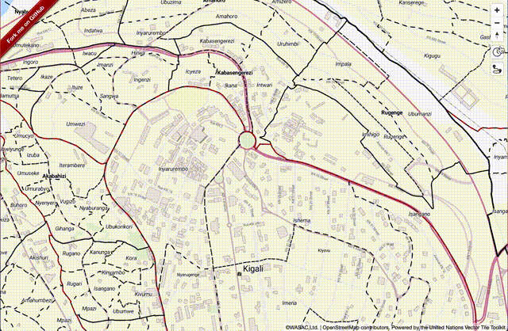

[Valhalla](https://github.com/valhalla/valhalla) is an open source routing engine with OSM data. Particulaly its ISOChrone API might be very useful to manage water supply.

In this section, we are going to setup Valhalla API on your own server in GCP and add the API funciton into your Mapbox GL JS app.

Through this session, you will be able to learn;

- How to setup Valhalla API
- How to setup Let's Encrypt to enable SSL
- How to add valhalla plugin to your app

## Next

Now, we are going to setup Valhalla on your GCP.