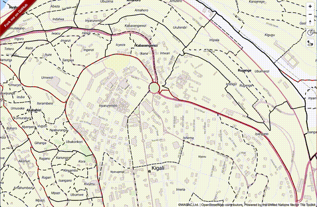

[Valhalla](https://github.com/valhalla/valhalla)はOSMベースのオープンソースのルーティングエンジンです。特にISOChrone（等時線）APIは水道のマネジメントに有効活用できるかもしれません。

このセクションでは、GCP上のサーバーにValhalla APIをセットアップし、Mapbox GL JSアプリにプラグインを追加していきます。

このセッションを通し、以下のことがdけいるようになります。
- Valhalla APIのセットアップ
- Let's Encryptを使ったSSL化
- valhalla pluginのアプリへの追加

## 次へ

それではGCPにValhallaをセットアップしましょう。